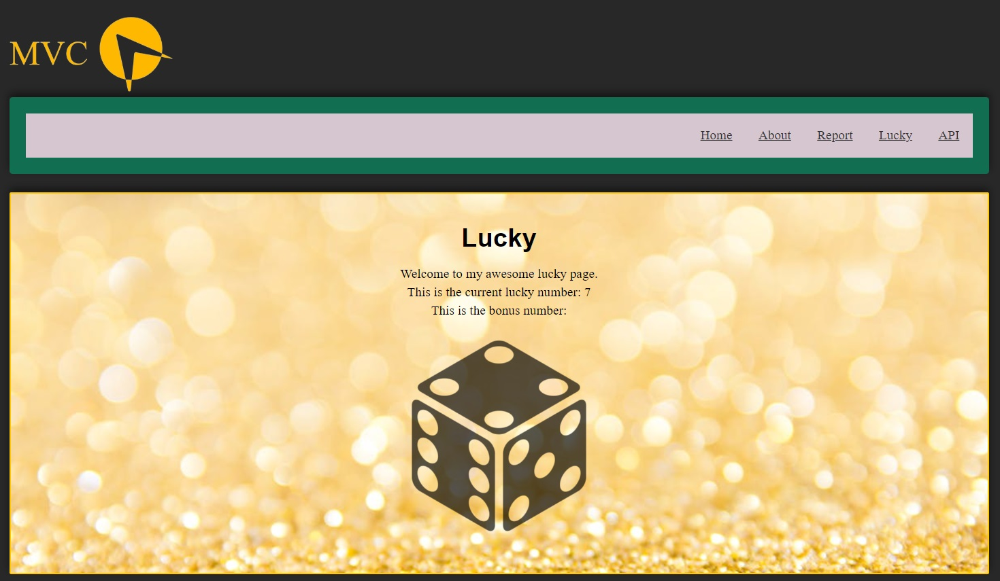

<!--
---
author: owsu23
revision:
    "2024-03-29": "(A, owsu23) Kmom01."
---
-->



[](https://scrutinizer-ci.com/g/airhelios/mvc/?branch=main)
[](https://scrutinizer-ci.com/g/airhelios/mvc/?branch=main)
[](https://scrutinizer-ci.com/g/airhelios/mvc/build-status/main)
[](https://scrutinizer-ci.com/code-intelligence)

Get going with MVC
====================

This project is based on Symfony with the template engine Twig, the styling is done with [SASS](https://symfony.com/bundles/SassBundle/current/index.html). A controller that provides a REST API with JSON responses will be created among other things.

How to clone the git repository:

```
git clone https://github.com/airhelios/mvc
```

Then go to the report/ directory and start the app with:

```
# You are in the report/ directory
php -S localhost:8888 -t public
```

* [Documentation](#documentation)
* [Useful Commands](#Useful-Commands)
    * [GIT Commands](#GIT-Commands)
    * [SASS Commands](#SASS-Commands)

Documentation
----------------------------
This project will be built in 7 steps. The aim is to fulfill all requirements from the course [Objektorienterade webbteknologier](https://www.bth.se/utbildning/program-och-kurser/kurser/20241/BEGJ7/). The requirements can be found [here](https://dbwebb.se/kurser/mvc-v2).

The special setup for Symfony that is used in this project is based on [these documents](https://github.com/dbwebb-se/mvc/blob/main/example/symfony/README.md).

Useful Commands
----------------------------
You will find useful CLI commands below.
### GIT Commands

```
# Upload to Github
git add .
git commit -m "Comments"
git push
```

```
# Add tag
git tag -a v1.0.0 -m "First version"
git push --tags
```

### SASS Commands

```
# Manually update SCSS to CSS
npm run build
```

```
# Automatically update SCSS when changed
npm run watch
```