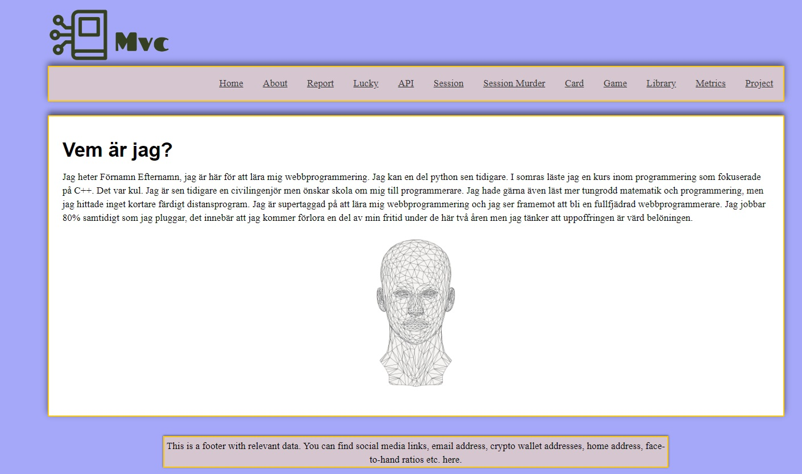
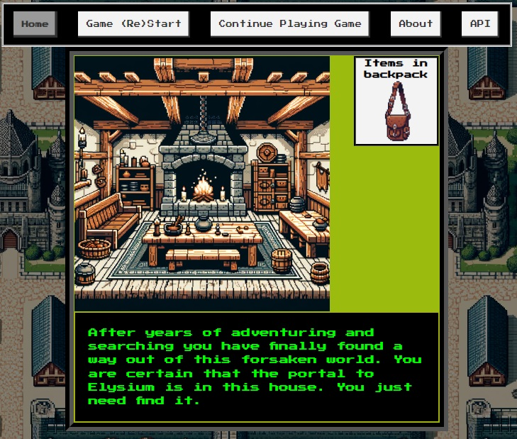

<!--
---
author: owsu23
revision:
    "2024-05-22": "(B, owsu23) Kmom10 update."
    "2024-03-29": "(A, owsu23) Kmom01."
---
-->


[](https://scrutinizer-ci.com/g/airhelios/mvc/?branch=main)  
[](https://scrutinizer-ci.com/g/airhelios/mvc/?branch=main)  
[](https://scrutinizer-ci.com/g/airhelios/mvc/build-status/main)  
[](https://scrutinizer-ci.com/code-intelligence)  


MVC(DV1608/Objekt Orienterade webbteknologier) Course Repo
====================

* [Technologies](#technologies)
    * [How to clone this repo](#how-to-clone-the-git-repository)
* [Final Project](#final-project)


This repo contains the code for all course projects in the course [DV1608](https://www.bth.se/utbildning/program-och-kurser/kurser/20241/BEGJ7/) (vt24) at BTH. The aim of the course is to teach the MVC pattern by using the PHP web framework known as Symfony. The course projects are divided into:
- Frameworks
- Object Oriented Programming
- Applications in Symfony
- Unit testing
- ORM/Database-connections
- Automated testing
- Final project and examination

Technologies
----------------------------
The technologies implemented are, among others:

- **PHP with Symfony** as a web framework
- **PHPUnit** for unit testing
- **PHP CS Fixer** to ensure the code adheres to the PSR12 standard
- **PHPMetrics** to analyze code quality
- **Scrutinizer** to analyze code quality and to ensure that the deployed version works
- **PHPMD and PHPStan** for mess detection, linting, and to proactively find bugs
- **PHPDoc** to generate documentation from the code
- **JavaScript, HTML, CSS, SASS**
- **GitHub**

How to clone the git repository:
----------------------------

```
git clone https://github.com/airhelios/mvc
```

Then go to the report/ directory and start the app with:

```
# You are in the report/ directory
php -S localhost:8888 -t public
```


Final Project
----------------------------

As a final project a point and click game (escape room) has been created in Symfony. The game has 3 levels with 2 alternate endings. The aim of the game is to reach the final level and to reach it you need to find the key(s) to open a hatch.

The controllers and classes that have been created for this project have a test coverage of close to 100%. All the abovemention technologies have been used in some capacity (Symfony, PHPunit, Scrutinizer, PHPMetrics etc.) Each click is tracked with JavaScript and a hidden form that uses the click coordinates and posts it to a Symfony route. All found items are saved in session to ensure persistence. Each level implements an abstract "Level"-class to ensure that the methods are defined in a uniform manner. The player gets an option to save their alias when the game has ended. The IP of the player, the players name and which plane they wound up in (hell/Elysium) is saved in three separate SQLite tables. There are API-routes that can be used to access these names and IP:s. There is also an option to reset all tables with the API.


